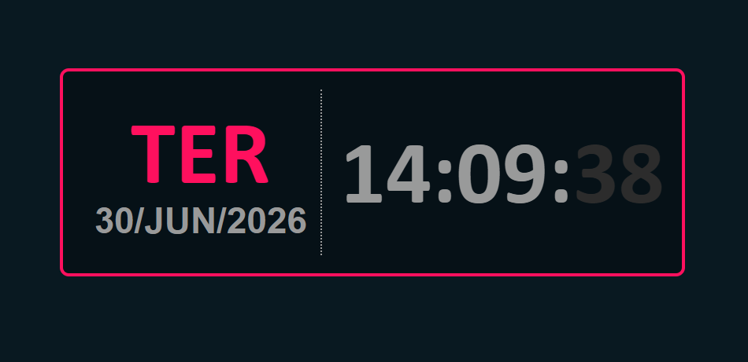

# digital_clock

---
title: "Digital Clock"
author: "Wenner Cruz Severino"
date: "`r Sys.Date()`"
output:
  github_document:
    toc: true
    toc_depth: 3
---

# Digital Clock

## Introdução

O **Digital Clock** é uma aplicação web desenvolvida utilizando **HTML5**, **CSS3** e **JavaScript**, com o objetivo de exibir, em tempo real, a data e a hora do sistema do usuário.

O relógio apresenta horas, minutos, segundos, dia da semana e data completa, atualizando automaticamente as informações sem necessidade de recarregar a página.

---

# Objetivos

Este projeto tem como principais objetivos:

- Desenvolver uma interface simples e responsiva para exibição da hora.
- Aplicar conceitos de manipulação do DOM utilizando JavaScript.
- Trabalhar com objetos de data e hora da linguagem JavaScript.
- Atualizar informações em tempo real utilizando temporizadores.
- Organizar a interface utilizando HTML e CSS.

---

# Tecnologias Utilizadas

- HTML5
- CSS3
- JavaScript

---

# Estrutura do Projeto

```
DigitalClock/
│
├── index.html
├── style.css
├── script.js
├── README.Rmd
├── README.md
└── imagens/
    ├── tela.png
    └── funcionamento.png
```

---

# Estrutura HTML

A interface principal é composta por um contêiner central que agrupa a data e o horário.

```html
<div class="container">
    <div class="clock">
        <div class="date">
            <p id="week-day">SEX</p>
            <p id="current-date">01/10/2021</p>
        </div>

        <div class="time">
            <p id="hours">19</p>
            <p>:</p>
            <p id="minutes">20</p>
            <p>:</p>
            <p id="seconds">45</p>
        </div>
    </div>
</div>
```

Cada elemento possui um identificador (`id`) para que o JavaScript possa atualizar seu conteúdo dinamicamente.

---

# Funcionamento

Ao carregar a página, o arquivo `script.js` obtém a data e a hora atuais do sistema utilizando o objeto `Date`.

As informações extraídas incluem:

- Dia da semana
- Dia do mês
- Mês
- Ano
- Horas
- Minutos
- Segundos

Esses valores são inseridos nos elementos HTML correspondentes por meio da manipulação do DOM.

A atualização ocorre continuamente, garantindo que o relógio permaneça sincronizado com o horário do sistema.

---

# Componentes da Interface

## Data

A seção superior apresenta:

- Dia da semana
- Data completa

Exemplo:

```
SEX
01/10/2021
```

---

## Horário

A parte inferior exibe:

```
19 : 20 : 45
```

O horário é dividido em:

- Horas
- Minutos
- Segundos

Os separadores (`:`) são utilizados apenas para melhorar a legibilidade.

---

# Manipulação do DOM

Os elementos da página são identificados através dos seguintes IDs:

| Elemento | ID |
|----------|----------------|
| Dia da semana | week-day |
| Data | current-date |
| Horas | hours |
| Minutos | minutes |
| Segundos | seconds |

O JavaScript atualiza o conteúdo desses elementos em tempo real.

---

# Atualização Automática

O relógio permanece sincronizado utilizando uma função executada periodicamente.

Essa atualização contínua permite que:

- segundos avancem automaticamente;
- minutos sejam atualizados corretamente;
- horas acompanhem o relógio do sistema.

---

# Interface

A Figura 1 apresenta a interface principal da aplicação.



*Figura 1 – Interface do relógio digital.*

---

# Como Executar

1. Faça o download do projeto.

2. Abra a pasta do projeto.

3. Execute o arquivo:

```
index.html
```

em qualquer navegador moderno.

Não é necessária nenhuma instalação adicional.

---

# Funcionalidades

- Exibição da hora em tempo real.
- Exibição da data atual.
- Exibição do dia da semana.
- Atualização automática.
- Interface simples e intuitiva.
- Compatível com os principais navegadores.

---

# Possíveis Melhorias

Algumas funcionalidades que podem ser adicionadas futuramente:

- Alternância entre formato 12h e 24h.
- Tema claro e escuro.
- Ajuste de fuso horário.
- Cronômetro.
- Temporizador.
- Alarme.
- Exibição do calendário mensal.
- Animações durante a troca dos números.

---

# Conclusão

O desenvolvimento do Digital Clock permitiu aplicar conceitos fundamentais do desenvolvimento web, especialmente relacionados à manipulação do DOM e ao uso do objeto `Date` do JavaScript.

A aplicação apresenta uma interface organizada, atualiza automaticamente as informações exibidas e demonstra como integrar HTML, CSS e JavaScript para criar componentes dinâmicos e interativos.

Além de cumprir o objetivo de exibir a data e o horário em tempo real, o projeto serve como base para implementações mais avançadas, como cronômetros, alarmes e sistemas de gerenciamento de tempo.

---

# Autor

**Wenner Cruz Severino**
